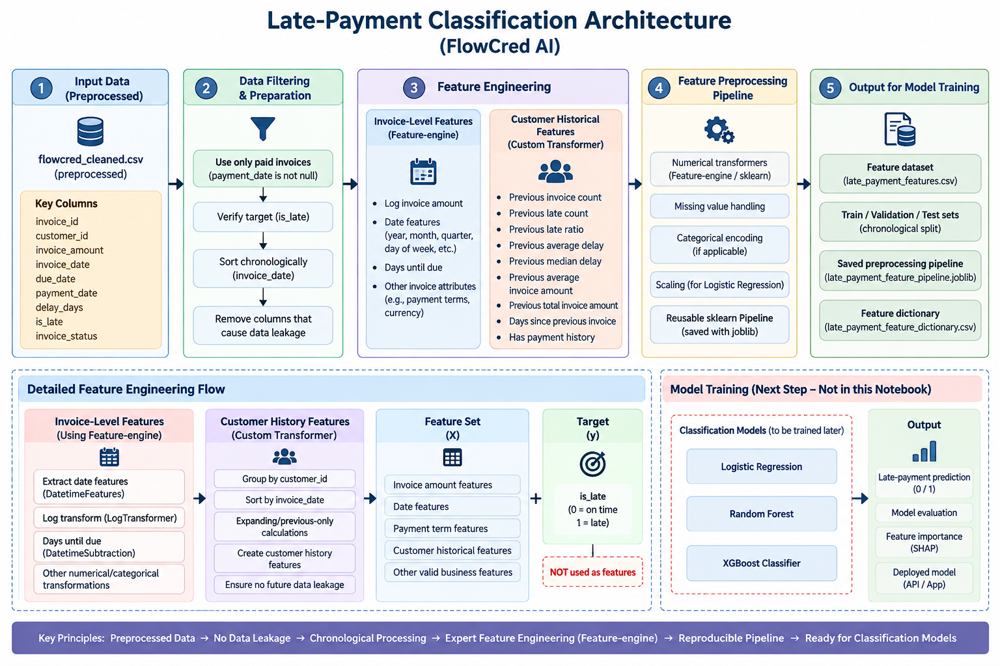
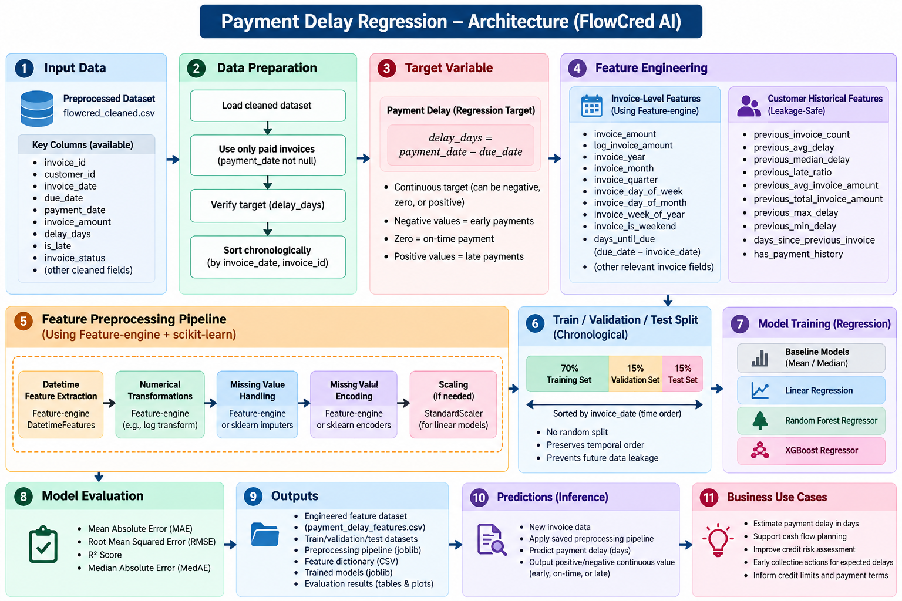
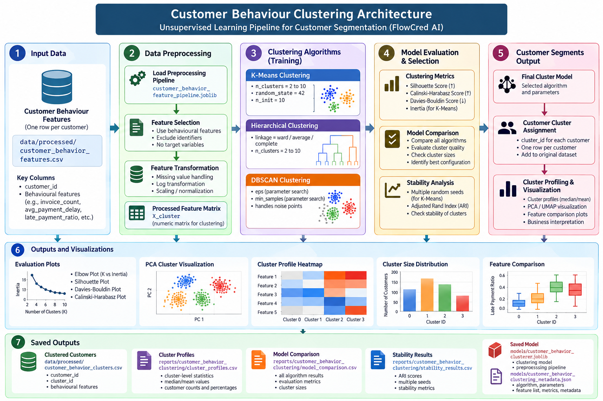
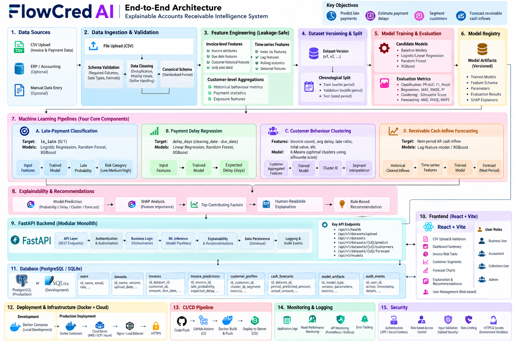

# 💳 FlowCred AI

<p align="center">
  <strong>Intelligent Payment Risk & Customer Behaviour Analytics</strong><br/>
  <em>Predict late payments • Estimate payment delays • Discover customer behaviour</em>
</p>

<p align="center">
  
  
  
  
  
</p>

---

## 🚀 What is FlowCred AI?

**FlowCred AI** is a machine-learning project for analyzing invoice and payment behaviour to turn historical transaction data into actionable payment-risk signals.

The project combines three complementary ML capabilities:

| Capability | Question answered | Model |
|---|---|---|
| 🔴 **Late-Payment Classification** | *Is this invoice likely to be paid late?* | XGBoost |
| ⏱️ **Payment-Delay Regression** | *If payment is delayed, approximately how many days will the delay be?* | HistGradientBoosting |
| 👥 **Customer Behaviour Clustering** | *What type of payment behaviour does this customer exhibit?* | K-Means |

Rather than relying on a single prediction, FlowCred AI builds a **multi-view picture of payment behaviour** using invoice characteristics, temporal features, historical customer behaviour, payment history, payment terms, and currency information.

> **Note:** FlowCred AI is an analytics and decision-support project. Its predictions should be validated against business requirements and should not be treated as the sole basis for consequential financial decisions.

---

## 🧠 Core ML Pipeline

```
                         ┌─────────────────────┐
                         │  Invoice / Payment  │
                         │       Data          │
                         └──────────┬──────────┘
                                    │
                                    ▼
                         ┌─────────────────────┐
                         │ Data Preprocessing  │
                         │ & Quality Checks    │
                         └──────────┬──────────┘
                                    │
                                    ▼
                         ┌─────────────────────┐
                         │ Feature Engineering │
                         │ Temporal + History  │
                         └──────────┬──────────┘
                                    │
                 ┌──────────────────┼──────────────────┐
                 │                  │                  │
                 ▼                  ▼                  ▼
       ┌─────────────────┐ ┌─────────────────┐ ┌─────────────────┐
       │ Late Payment    │ │ Payment Delay   │ │ Customer        │
       │ Classification  │ │ Regression      │ │ Behaviour       │
       │                 │ │                 │ │                 │
       │    XGBoost      │ │ HistGradient    │ │    K-Means      │
       │                 │ │    Boosting     │ │                 │
       └────────┬────────┘ └────────┬────────┘ └────────┬────────┘
                │                   │                   │
                ▼                   ▼                   ▼
       ┌─────────────────┐ ┌─────────────────┐ ┌─────────────────┐
       │ Late-payment    │ │ Expected delay  │ │ Behaviour       │
       │ probability /   │ │ in days         │ │ segment         │
       │ risk signal     │ │                 │ │                 │
       └─────────────────┘ └─────────────────┘ └─────────────────┘
```

---

## 📊 Model 1 — Late-Payment Classification

The classification pipeline predicts whether an invoice is likely to become a **late payment**.

### Feature groups

- Invoice amount
- Log-transformed invoice amount
- Invoice year / month / quarter
- Day-of-week and calendar features
- Weekend indicator
- Days until due
- Previous invoice count
- Previous late-payment count
- Historical late-payment ratio
- Historical average and median delay
- Historical average and total invoice amount
- Days since previous invoice
- Payment-history availability

### Model

**XGBoost**

The training pipeline uses chronological train/validation/test splits to preserve temporal ordering.

### Current test results

| Metric | Test |
|---|---:|
| Accuracy | **0.7809** |
| Precision | **0.7389** |
| Recall | **0.6882** |
| F1 | **0.7127** |
| ROC-AUC | **0.8436** |
| PR-AUC | **0.8070** |

An operational threshold of **0.45** is also evaluated separately, giving a test recall of **0.7240** and F1 of **0.7197**.



---

## ⏱️ Model 2 — Payment-Delay Regression

The regression pipeline estimates the expected **number of payment-delay days**.

### Feature groups

The model combines invoice, calendar, customer-history, payment-history, payment-term, and currency features.

Historical features include:

- Previous invoice count
- Previous paid invoice count
- Previous late invoice count
- Previous late-payment ratio
- Previous average / median / min / max delay
- Previous invoice amount statistics
- Days since previous invoice
- Payment-history indicator
- Customer payment terms
- Invoice currency

### Model

**HistGradientBoosting**

The current pipeline uses frozen hyperparameters and a train+validation refit before the final test evaluation.

### Current test results

| Metric | Test |
|---|---:|
| MAE | **3.2768 days** |
| RMSE | **7.7524 days** |
| R² | **0.4694** |
| Median Absolute Error | **1.6130 days** |



---

## 👥 Model 3 — Customer Behaviour Clustering

FlowCred AI also performs unsupervised customer segmentation to identify recurring payment-behaviour patterns.

### Behavioural features

The clustering representation includes:

- Invoice frequency
- Active months
- Customer lifetime
- Average days between invoices
- Total / average / median invoice amount
- Invoice amount variability
- Paid / open / late / on-time invoice counts
- Late-payment ratio
- Early-payment ratio
- Average / median / standard deviation of payment delay
- Payment-delay streaks
- Days since last invoice/payment
- Recent payment behaviour
- Payment-term consistency
- Currency consistency

### Model

**K-Means**

- Clusters: **6**
- Random state: **42**
- Initialization: **10 runs**
- Customers used for clustering: **1,425**

### Clustering evaluation

| Metric | Value |
|---|---:|
| Silhouette Score | **0.8006** |
| Calinski-Harabasz Score | **3954.67** |
| Davies-Bouldin Score | **0.5719** |
| Mean ARI across stability runs | **0.9742** |



---

## 🔬 Feature Engineering

A major part of FlowCred AI is converting raw invoice history into **behaviour-aware features**.

### 1. Temporal features

`invoice_date`
     │
     ├── year
     ├── month
     ├── quarter
     ├── day of week
     ├── day of month
     ├── week of year
     └── weekend flag
`

### 2. Historical customer features

Instead of looking only at the current invoice, the pipeline derives information from the customer's **previous transactions**, including:

- historical payment performance
- historical delay behaviour
- invoice frequency
- previous invoice volume
- historical invoice-value statistics
- recency of previous activity

This allows the models to capture **customer-specific payment behaviour** rather than treating every invoice independently.

### 3. Categorical features

Payment terms and invoice currencies are transformed into model-ready representations where required.

### 4. Log transformation

Invoice amount is represented both directly and through a logarithmic transformation to reduce the influence of extreme transaction values.

---

## 🧪 Chronological Evaluation

Payment behaviour is time-dependent, so the classification pipeline uses chronological partitions rather than randomly mixing historical and future records.

### Late-payment classifier

```
Historical data
──────────────────────────────────────────────────────────────► Time

        TRAIN                    VALIDATION             TEST
   2018-12-30 →              2019-10-09 →          2019-12-10 →
      2019-10-09               2019-12-10             2020-02-27
```

This helps evaluate the model in a setting closer to future prediction and reduces the risk of leaking future transaction information into historical training data.

---

## 📁 Project Structure

```
FlowCred_AI/
│
├── architectures/
│   ├── whole_architecture.png
│   ├── late-payment_classification.png
│   ├── payment_delay_regression.png
│   └── customer_behaviour_clustering.png
│
├── data/
│   ├── raw/
│   └── processed/
│
├── models/
│   ├── late_payment_classifier.joblib
│   ├── late_payment_feature_pipeline.joblib
│   ├── late_payment_model_metadata.json
│   │
│   ├── payment_delay_feature_pipeline.joblib
│   ├── payment_delay_model_metadata.json
│   │
│   ├── customer_behavior_clusterer.joblib
│   ├── customer_behavior_feature_pipeline.joblib
│   └── customer_behavior_clustering_metadata.json
│
├── notebooks/
│   ├── 01_data_preprocessing.ipynb
│   ├── 1.5_data_quality_validation.ipynb
│   ├── 02_late_payment_feature_engineering.ipynb
│   ├── 03_late_payment_classification.ipynb
│   ├── 04_payment_delay_feature_engineering.ipynb
│   ├── 05_payment_delay_regression_training.ipynb
│   ├── 06_customer_behavior_feature_engineering.ipynb
│   └── 07_customer_behavior_clustering.ipynb
│
├── reports/
│   ├── late-payment_classification/
│   ├── payment_delay/
│   ├── customer_behavior/
│   └── customer_behavior_clustering/
│
└── requirements.txt
```

---

## 🧭 Notebook Workflow

The notebooks are organized as a reproducible ML workflow:

| Step | Notebook | Purpose |
|---|---|---|
| 01 | `01_data_preprocessing.ipynb` | Clean and prepare the dataset |
| 01.5 | `1.5_data_quality_validation.ipynb` | Validate data quality and assumptions |
| 02 | `02_late_payment_feature_engineering.ipynb` | Build classification features |
| 03 | `03_late_payment_classification.ipynb` | Train and evaluate XGBoost classifier |
| 04 | `04_payment_delay_feature_engineering.ipynb` | Build regression features |
| 05 | `05_payment_delay_regression_training.ipynb` | Train and evaluate delay regression |
| 06 | `06_customer_behavior_feature_engineering.ipynb` | Build customer-level behavioural features |
| 07 | `07_customer_behavior_clustering.ipynb` | Perform and evaluate customer clustering |

---

## 🛠️ Tech Stack

### Machine Learning

- **Python 3.14**
- **XGBoost**
- **scikit-learn**
- **Feature-engine**
- **SciPy**
- **Joblib**

### Data & Analysis

- **NumPy**
- **Pandas**

### Explainability & Visualization

- **SHAP**
- **Matplotlib**
- **Seaborn**
- Optional **UMAP** for clustering visualization

### Experimentation

- **Jupyter Notebook**
- **nbformat**
- **nbclient**
- **IPykernel**

---

## ⚙️ Installation

### 1. Clone the repository

```bash
git clone https://github.com/ThePranish03/FlowCred_AI.git
cd FlowCred_AI
```

### 2. Create a virtual environment

Windows:

```bash
python -m venv .venv
.venv\Scripts\activate
```

macOS / Linux:

```bash
python3 -m venv .venv
source .venv/bin/activate
```

### 3. Install dependencies

```bash
pip install -r requirements.txt
```

### 4. Launch Jupyter

```bash
jupyter notebook
```

Open the notebooks under:

`notebooks/`

and execute them in the documented order.

---

## 📦 Saved Model Artifacts

FlowCred AI stores trained model artifacts together with metadata describing the training configuration and evaluation results.

```
models/
│
├── Classifier
│   ├── late_payment_classifier.joblib
│   ├── late_payment_feature_pipeline.joblib
│   └── late_payment_model_metadata.json
│
├── Regression
│   ├── payment_delay_feature_pipeline.joblib
│   └── payment_delay_model_metadata.json
│
└── Clustering
    ├── customer_behavior_clusterer.joblib
    ├── customer_behavior_feature_pipeline.joblib
    └── customer_behavior_clustering_metadata.json
```

Keeping the preprocessing pipeline alongside the model helps ensure that inference uses the same feature transformations as training.

---

## 📈 Evaluation Philosophy

FlowCred AI evaluates each ML task according to its purpose:

### Classification

Uses:

- Accuracy
- Precision
- Recall
- F1
- ROC-AUC
- PR-AUC

### Regression

Uses:

- MAE
- RMSE
- R²
- Median Absolute Error

### Clustering

Uses:

- Silhouette Score
- Calinski-Harabasz Score
- Davies-Bouldin Score
- Cluster stability using Adjusted Rand Index

This provides multiple perspectives instead of relying on a single metric.

---

## 🗺️ End-to-End Architecture



The complete architecture connects:

**Data → Quality Validation → Feature Engineering → ML Tasks → Model Artifacts → Reports & Risk Insights**

---

## 🔮 Future Extensions

Potential extensions for FlowCred AI include:

- 📊 Interactive payment-risk dashboard
- 🔔 Early-warning alerts for high-risk invoices
- 🧠 SHAP-based per-invoice explanations
- 📅 Expected payment-date prediction
- 👥 Richer customer risk profiles
- 🔄 Automated model retraining
- 📡 Batch and real-time inference pipelines
- 📈 Model monitoring and drift detection
- 🧪 Temporal cross-validation and continuous backtesting
- 🚀 API layer for production inference

---

## 🔐 Responsible Use

Payment-risk models can influence important business decisions. FlowCred AI should therefore be deployed with appropriate validation, monitoring, human oversight, and domain-specific controls.

In particular:

- Validate predictions on data representative of the deployment environment.
- Monitor model performance over time.
- Check for data leakage during feature engineering.
- Review changes in customer and payment distributions.
- Use explanations and business rules alongside model outputs.
- Avoid using model predictions as the sole basis for consequential decisions.

---

## 👨‍💻 Author

**Pranish Belsare**

Computer Science & Artificial Intelligence / Machine Learning

🔗 **GitHub:** [@ThePranish03](https://github.com/ThePranish03)

---

<p align="center">
  <strong>FlowCred AI</strong><br/>
  <sub>From invoice history to intelligent payment insights.</sub>
</p>
